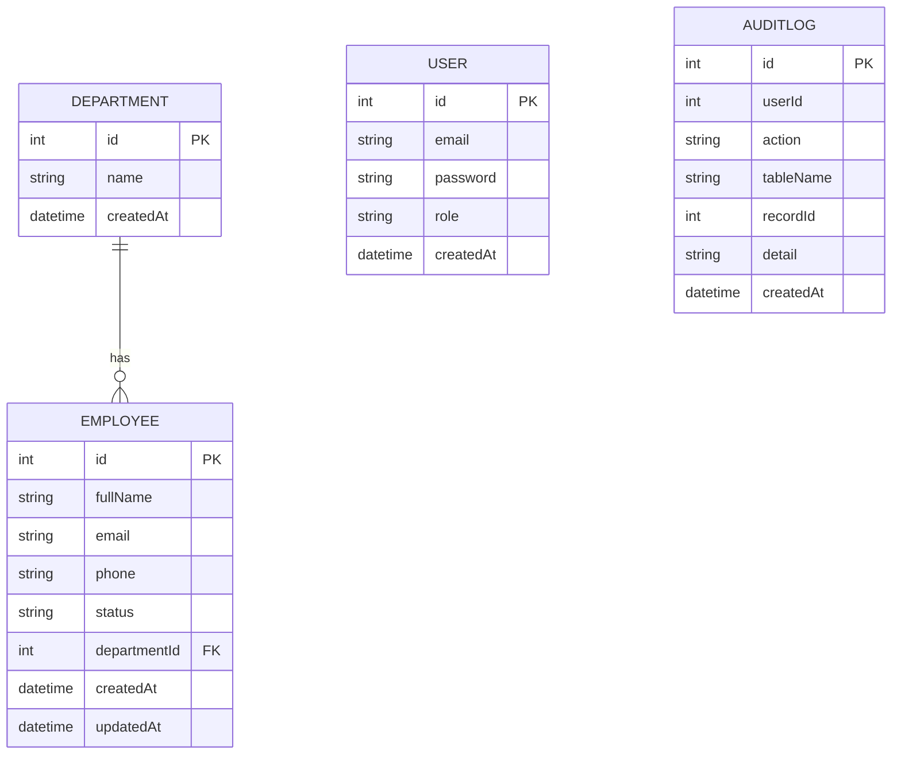

# Employee MS (Management System)

Aplikasi web pengelolaan data karyawan (REST API + React) untuk Tugas Rekrutmen Maspion.

## Tech Stack

- **Backend**: Node.js, Express 5, Prisma ORM
- **Database**: PostgreSQL (Supabase, free tier)
- **Frontend**: React + TypeScript (Vite), Tailwind CSS, React Router
- **Auth**: JWT, bcrypt (password hashing)

## Live Demo

- Frontend: `https://employeems-main.vercel.app/`
- Backend API: `https://employeems-backend.up.railway.app`
- API Docs: `https://employeems-main.vercel.app/api-documentation`
- Video Demo: `https://drive.google.com/file/d/1HGMcfOs28IshLuiHmJ55OKGqoFI0Pmzu/view?usp=sharing`

**Akun demo:**
| Role | Email | Password |
|---|---|---|
| Admin | admin@employeems.com | admin123 |
| Viewer | viewer@employeems.com | viewer123 |

## ERD / Skema Database



## Setup Lokal

### 1. Clone & Install

```bash
git clone <url-repo-ini>
cd employeeMS
```

### 2. Backend

```bash
cd backend
npm install
```

Buat file `.env` di folder `backend`, isi:

```bash
PORT=5000
DATABASE_URL="postgresql://..."
DIRECT_URL="postgresql://..."
JWT_SECRET="..."
```

Jalankan migration & seed:

```bash
npx prisma migrate dev
npx prisma db seed
```

Jalankan server:

```bash
npm run dev
```

Server jalan di `http://localhost:5000`.

### 3. Frontend

```bash
cd frontend
npm install
```

Buat file `.env` di folder `frontend`, isi:

```bash
VITE_API_URL=http://localhost:5000/api
```

Jalankan:

```bash
npm run dev
```

Buka `http://localhost:5173`.

## Menjalankan Test

```bash
cd backend
npm test
```

Test mencakup: health check, login sukses, login gagal (kredensial salah).

## Daftar Endpoint

| Method | Endpoint | Auth | Role | Deskripsi |
|---|---|---|---|---|
| GET | `/health` | - | - | Health check |
| POST | `/api/auth/login` | - | - | Login, mengembalikan JWT |
| GET | `/api/employees` | ✓ | admin, viewer | List employee (support `search`, `departmentId`, `status`, `sortBy`, `order`, `page`, `limit`) |
| GET | `/api/employees/:id` | ✓ | admin, viewer | Detail employee |
| POST | `/api/employees` | ✓ | admin | Tambah employee |
| PUT | `/api/employees/:id` | ✓ | admin | Update employee |
| DELETE | `/api/employees/:id` | ✓ | admin | Hapus employee |
| GET | `/api/employees/export/csv` | ✓ | admin, viewer | Export data ke CSV |
| GET | `/api/departments` | ✓ | admin, viewer | List department |
| POST | `/api/departments` | ✓ | admin | Tambah department |

Dokumentasi interaktif (mini Postman) tersedia di halaman **`/api-documentation`** pada frontend.

## Fitur Keamanan

- JWT-based auth dengan role `admin` (full access) dan `viewer` (read-only)
- Password di-hash dengan bcrypt
- Rate limiting pada seluruh route `/api`
- Audit log otomatis pada setiap create/update/delete employee & department